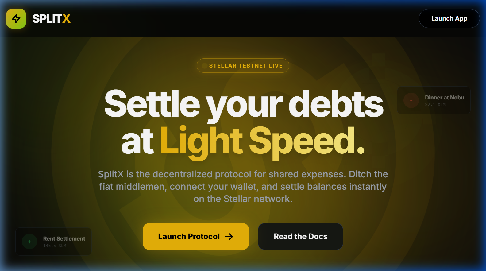
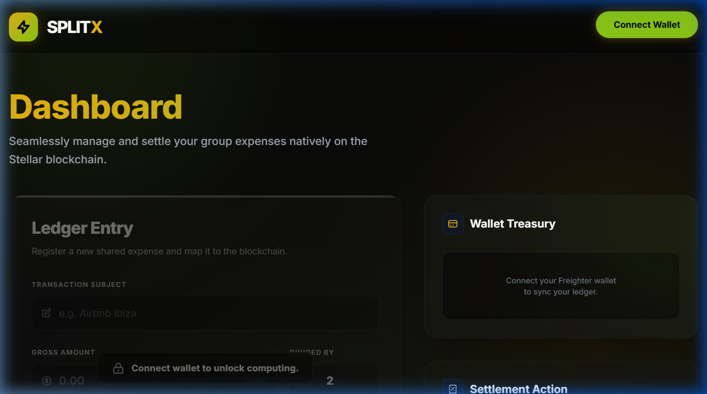
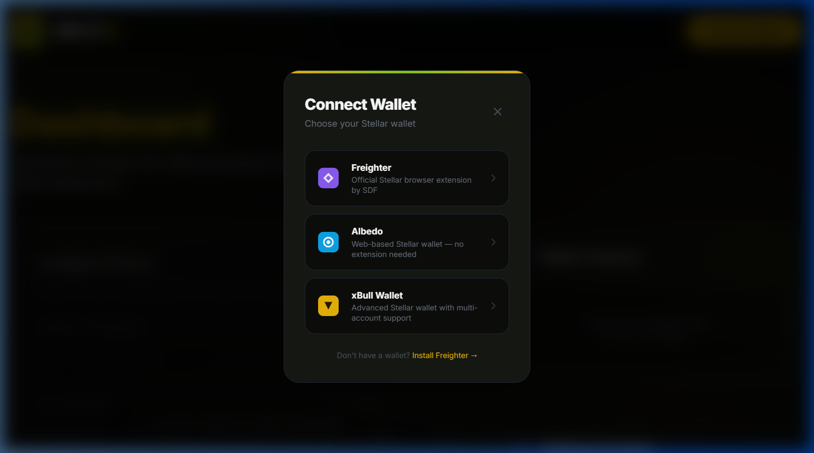
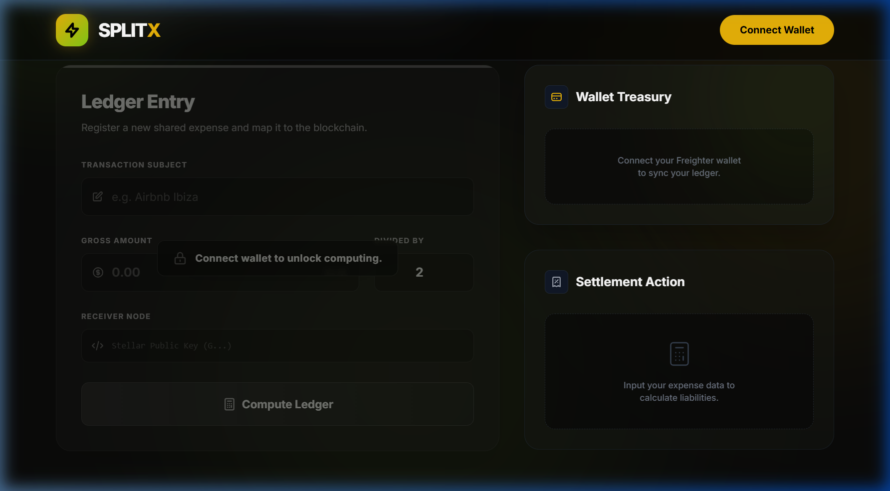
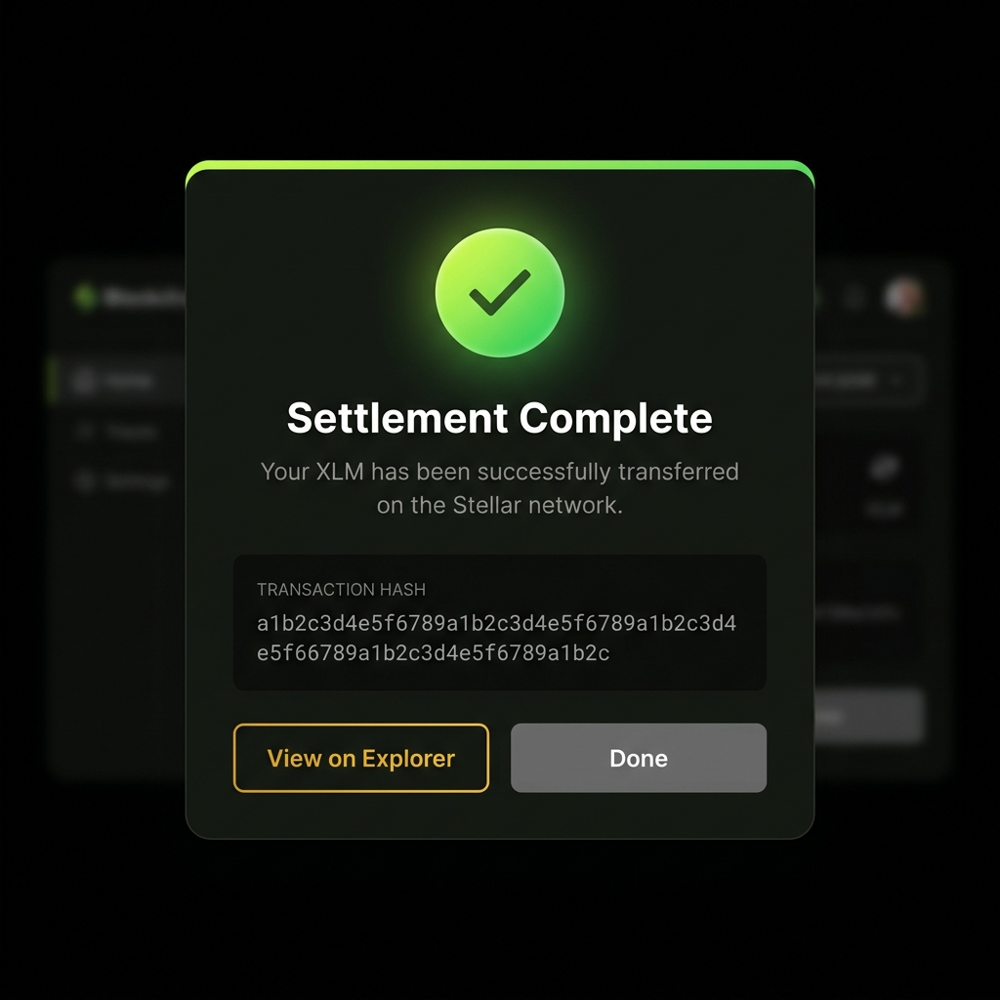
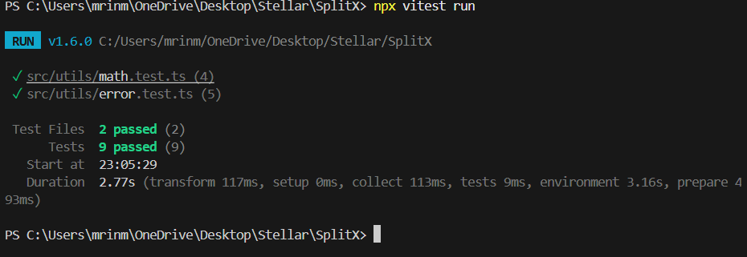

<p align="center">
  
  
  
  
  
</p>

<h1 align="center">⚡ SplitX</h1>
<h3 align="center">Decentralized Expense Splitting & Settlement on Stellar</h3>

<p align="center">
  <i>Split bills. Settle debts. All on-chain. All at light speed.</i>
</p>

<p align="center">
  <a href="https://split-x-three.vercel.app/"><b>🌐 Live Demo →</b></a>
</p>

---

## 📖 Overview

**SplitX** is a blockchain-powered expense splitting dApp built on the **Stellar Testnet**. It lets users connect their Freighter, Albedo, or xBull wallet, calculate shared expenses, and instantly settle debts by sending XLM — with every settlement logged permanently on-chain via a deployed **Soroban smart contract**.

> **⚪️ Level 1 — White Belt: ✅ COMPLETE**
> **🟡 Level 2 — Yellow Belt: ✅ COMPLETE**

### The Problem

Group expenses (rent, travel, dining) are hard to track and settle. Web2 apps like Splitwise lack integrated payment rails, while existing Web3 tools are too complex for everyday use.

### The Solution

SplitX combines the intuitive UX of expense-tracking apps with the instant, near-zero-cost transaction rails of the Stellar network. Calculate splits and settle in one click — no intermediaries, no delays.

---

## ✨ Features

| Feature | Description |
|---|---|
| 🔗 **Multi-Wallet** | Connect via Freighter, Albedo, or xBull using StellarWalletsKit |
| 💰 **Live Balance** | Real-time XLM balance fetched from Stellar Horizon Testnet |
| 🧮 **Expense Splitting** | Input expenses, split count, auto-calculate per-person liability |
| 🚀 **On-Chain Settlement** | Build, sign, and submit XLM payment + Soroban contract call |
| 📜 **Smart Contract** | expense_logger contract logs every settlement permanently on-chain |
| ⚠️ **3 Error Types** | Wallet not found / Transaction rejected / Insufficient balance |
| 📊 **Real-Time Status** | 6-step progress tracker + elapsed timer during transactions |
| 🎨 **Premium UI** | Dark theme, animated gradients, glassmorphism, Inter font |

---

## 📸 Screenshots

### Landing Page

The hero page with the "Settle your debts at Light Speed" tagline, STELLAR TESTNET LIVE badge, animated background blobs, decorative floating transaction cards, and call-to-action buttons.

<p align="center">
  
</p>

### Dashboard — Wallet Disconnected

The main dashboard before connecting a wallet. The Ledger Entry form is locked with a "Connect wallet to unlock computing" overlay. The Wallet Treasury prompts for connection.

<p align="center">
  
</p>

### Wallet Selection — Connect Wallet Modal

Clicking "Connect Wallet" opens the multi-wallet selection modal powered by **StellarWalletsKit v2**. Users can choose from **Freighter** (official SDF extension), **Albedo** (web-based, no extension needed), or **xBull Wallet** (advanced multi-account). A direct install link is shown for users without a wallet.

<p align="center">
  
</p>

### Dashboard — Full Form & Settlement

Scrolled view showing the complete Ledger Entry form (Transaction Subject, Gross Amount in XLM, Split Count, Receiver Node address), the Compute Ledger button, and the Settlement Action card.

<p align="center">
  
</p>

### Wallet Connected + Balance Displayed

> After connecting Freighter, Albedo, or xBull — the navbar shows the wallet provider name + truncated public key with a live green indicator. The Wallet Treasury widget displays the XLM balance and Stellar Testnet network badge.

*(Connect your wallet on the [live demo](https://split-x-three.vercel.app/) to see this in action)*

### Successful Transaction + Result

> After computing the ledger and clicking "Execute Settlement", the transaction is signed by the connected wallet and submitted to the network. A success modal displays both the **payment TX hash** and the **Soroban contract call TX hash** with direct "View on Explorer" links.

*(Execute a testnet settlement on the [live demo](https://split-x-three.vercel.app/) to see the full transaction flow)*

---

## 🏗️ System Architecture

### High-Level Architecture

```
┌─────────────────────────────────────────────────────────────┐
│                       USER (Browser)                        │
│                                                             │
│  ┌──────────────┐  ┌──────────────┐  ┌───────────────────┐ │
│  │ Landing Page  │  │  Dashboard   │  │ Transaction Modal │ │
│  │  (Hero UI)    │  │ (Expense UI) │  │    (Feedback)     │ │
│  └──────┬───────┘  └──────┬───────┘  └────────┬──────────┘ │
│         └─────────────────┼───────────────────┘             │
│                           │                                 │
│                  ┌────────▼─────────┐                       │
│                  │     App.tsx      │                       │
│                  │  (State + Logic) │                       │
│                  └──┬───────────┬───┘                       │
│                     │           │                           │
│          ┌──────────▼──┐  ┌────▼───────────────┐           │
│          │  Freighter   │  │   Stellar SDK      │           │
│          │  Wallet API  │  │ TransactionBuilder │           │
│          └──────┬───────┘  └────┬──────────────┘           │
│                 │               │                           │
└─────────────────┼───────────────┼───────────────────────────┘
                  │               │
        ┌─────────▼───────────────▼───────────┐
        │       Stellar Testnet Network       │
        │                                     │
        │  ┌────────────┐  ┌───────────────┐  │
        │  │ Horizon API │  │ Stellar Core  │  │
        │  │  (REST)     │  │  (Ledger)     │  │
        │  └────────────┘  └───────────────┘  │
        └─────────────────────────────────────┘
```

### Transaction Flow (Sequence Diagram)

```
 ┌──────┐      ┌──────────┐      ┌──────────┐      ┌──────────┐      ┌─────────┐
 │ User │      │ App.tsx  │      │ Horizon  │      │Freighter │      │ Stellar │
 │      │      │          │      │ (Testnet)│      │ Wallet   │      │ Network │
 └──┬───┘      └────┬─────┘      └────┬─────┘      └────┬─────┘      └────┬────┘
    │               │                  │                  │                 │
    │ Fill form +   │                  │                  │                 │
    │ click Compute │                  │                  │                 │
    ├──────────────►│                  │                  │                 │
    │               │                  │                  │                 │
    │  Click        │ loadAccount()    │                  │                 │
    │  "Execute     ├─────────────────►│                  │                 │
    │  Settlement"  │ ◄─ sequence num  │                  │                 │
    ├──────────────►│    + base fee    │                  │                 │
    │               │                  │                  │                 │
    │               │ Build Payment    │                  │                 │
    │               │ Operation (XDR)  │                  │                 │
    │               │                  │                  │                 │
    │               │ signTransaction(xdr)                │                 │
    │               ├────────────────────────────────────►│                 │
    │               │                  │                  │                 │
    │               │                  │   User reviews   │                 │
    │               │                  │   & confirms ✓   │                 │
    │               │ ◄── signedTxXdr ─┤                  │                 │
    │               │                  │                  │                 │
    │               │ submitTransaction(signedTx)         │                 │
    │               ├─────────────────►│─────────────────────────────────►│
    │               │                  │                  │                 │
    │               │ ◄── tx hash ─────│◄──── result ─────┤                 │
    │               │                  │                  │                 │
    │ Success modal │                  │                  │                 │
    │ + tx hash +   │                  │                  │                 │
    │ Explorer link │                  │                  │                 │
    │◄──────────────┤                  │                  │                 │
    │               │                  │                  │                 │
```

### Component Architecture

```
App.tsx ─────────────────────── Root State Manager
│
├── State
│   ├── wallet: string | null
│   ├── balance: string | null
│   ├── splitResult: { name, perPerson, address, total }
│   ├── txStatus: 'idle' | 'signing' | 'submitting' | 'success' | 'error'
│   ├── txHash: string | null
│   └── txError: string | null
│
├── Logic
│   ├── connectWallet()    → Freighter setAllowed() + getUserInfo()
│   ├── disconnectWallet() → Clear all state
│   ├── fetchBalance()     → Horizon loadAccount() → native balance
│   ├── handleCalculateSplit() → amount / splitCount → 7-decimal precision
│   └── settleDebt()       → Build tx → Sign (Freighter) → Submit (Horizon)
│
├── <Navbar />
│   ├── Logo + Brand ("SPLITX")
│   ├── [Disconnected] → "Connect Wallet" button
│   └── [Connected]    → Wallet pill (address + Disconnect)
│
├── <LandingPage />                   ← view === 'landing'
│   ├── STELLAR TESTNET LIVE badge
│   ├── Hero text + animated background
│   ├── CTAs: "Launch Protocol" / "Read the Docs"
│   └── Decorative floating transaction cards
│
├── <Dashboard />                     ← view === 'app'
│   │
│   ├── <ExpenseForm />               ← Left column (7/12)
│   │   ├── Transaction Subject input
│   │   ├── Gross Amount (XLM) input
│   │   ├── Divided By input
│   │   ├── Receiver Node (Stellar Public Key) input
│   │   ├── "Compute Ledger" button
│   │   └── Wallet-lock overlay (when disconnected)
│   │
│   ├── <BalanceWidget />             ← Right column (5/12)
│   │   ├── Liquid Balance (large XLM display)
│   │   └── Network State badge ("Stellar Testnet")
│   │
│   └── <SettlementCard />            ← Right column (5/12)
│       ├── [Empty state] → "Input expense data to calculate"
│       └── [With result]
│           ├── Expense name + total invoice
│           ├── Per-person liability (gradient text)
│           ├── Recipient address
│           └── "Execute Settlement" glowing CTA
│
└── <TransactionModal />              ← Full-screen overlay (z-100)
    ├── [signing]    → Orbital ring animation + "Awaiting Signature"
    ├── [submitting] → Broadcasting animation + "Submitting to Testnet"
    ├── [success]    → ✓ Checkmark + tx hash + "View on Explorer" link
    └── [error]      → ✗ Error details + "Retry" button
```

### Data Flow Diagram

```
                    ┌──────────────────────────────────┐
                    │          Freighter Wallet         │
                    │    (Browser Extension/Signer)     │
                    └──────────┬───────────────────────┘
                               │ signTransaction()
                               │ returns signedTxXdr
                               │
┌──────────┐   setAllowed()   ┌▼──────────────────────┐   loadAccount()    ┌─────────────┐
│          │   getUserInfo()  │                        │   fetchBaseFee()   │             │
│  User    ├─────────────────►│       App.tsx          ├──────────────────►│   Horizon    │
│  (UI)    │◄─────────────────┤   (State Manager)     │◄──────────────────┤   Testnet    │
│          │   render(state)  │                        │   account data    │   REST API   │
└──────────┘                  │  • wallet state        │   + tx result     │             │
                              │  • balance state       │                   └──────┬──────┘
                              │  • split calculation   │ submitTransaction()      │
                              │  • tx lifecycle        ├──────────────────────────►│
                              └────────────────────────┘                   ┌──────▼──────┐
                                                                          │   Stellar    │
                                                                          │   Core       │
                                                                          │   (Ledger)   │
                                                                          └─────────────┘
```

---

## 🛠️ Tech Stack

| Layer | Technology | Purpose |
|---|---|---|
| **Framework** | React 18 + TypeScript | Component-based UI with type safety |
| **Build Tool** | Vite 4 | Lightning-fast HMR and builds |
| **Styling** | Tailwind CSS 3 | Utility-first CSS with custom design tokens |
| **Typography** | Inter (Google Fonts) | Modern, clean variable font |
| **Blockchain** | Stellar Testnet | Low-cost, fast transaction network |
| **Multi-Wallet** | `@creit.tech/stellar-wallets-kit` v2 | Freighter + Albedo + xBull unified API |
| **SDK** | `@stellar/stellar-sdk` | Transaction building, Horizon + SorobanRpc |
| **Smart Contract** | Rust + Soroban SDK v22 | `expense_logger` contract on testnet |
| **Contract CLI** | `stellar-cli` v25.2.0 | Contract build + deploy toolchain |
| **Hosting** | Vercel | Automatic deployments from GitHub |
| **Explorer** | Stellar Expert | Transaction verification links |

---

## 🚀 Getting Started

### Prerequisites

- **Node.js** v18+ → [nodejs.org](https://nodejs.org/)
- **pnpm** (or npm/yarn) → `npm install -g pnpm`
- **Freighter Wallet** browser extension → [freighter.app](https://www.freighter.app/)

### 1. Clone & Install

```bash
git clone https://github.com/Mrinmoy-programmer07/SplitX.git
cd SplitX
pnpm install
```

### 2. Run Development Server

```bash
pnpm run dev
```

The app will be available at **http://localhost:5173**

### 3. Configure Freighter

1. Install the [Freighter browser extension](https://www.freighter.app/)
2. Create or import a wallet
3. **Switch to Stellar Testnet** in Freighter settings (`Settings → Network → TESTNET`)
4. Fund your testnet account:
   ```
   https://friendbot.stellar.org/?addr=YOUR_PUBLIC_KEY
   ```

### 4. Build for Production

```bash
pnpm run build
pnpm run preview
```

---

## 📁 Project Structure

```
SplitX/
├── index.html                          # Entry HTML + SEO meta tags + Inter font
├── package.json                        # Dependencies & scripts
├── tailwind.config.js                  # Design tokens (colors, fonts, animations)
├── vite.config.ts                      # Vite configuration
├── tsconfig.json                       # TypeScript configuration
│
├── docs/
│   └── screenshots/                    # README screenshots
│
└── src/
    ├── App.tsx                         # Root — state, wallet, transactions
    ├── main.tsx                        # React entry point
    ├── index.css                       # Global styles + Tailwind directives
    │
    └── components/
        ├── ExpenseForm.tsx             # Expense input form with validation
        │
        ├── layout/
        │   └── Navbar.tsx              # Top nav (wallet connect/disconnect)
        │
        ├── pages/
        │   ├── Dashboard.tsx           # Main dashboard layout (grid)
        │   └── LandingPage.tsx         # Hero landing page with CTAs
        │
        └── dashboard/
            ├── BalanceWidget.tsx        # XLM balance display + network badge
            ├── SettlementCard.tsx       # Split result + execute settlement
            └── TransactionModal.tsx     # Tx feedback (loading/success/error)
```

---

## 🔄 How It Works

### Step-by-Step Flow

1. **Connect Wallet** → User clicks "Connect Wallet" → Freighter prompts for permission → Public key stored in app state.

2. **Fetch Balance** → App queries `horizon-testnet.stellar.org/accounts/{publicKey}` → Extracts native XLM balance → Renders in Wallet Treasury widget.

3. **Add Expense** → User fills in:
   - Transaction subject (e.g., "Airbnb Ibiza")
   - Gross amount in XLM (e.g., 100)
   - Split count (e.g., 4 people)
   - Receiver's Stellar public key

4. **Calculate Split** → App divides amount by split count → Displays per-person liability with 7-decimal precision.

5. **Execute Settlement** → One-click flow:
   ```
   Load Account (Horizon) → Build Payment Op → Convert to XDR
   → Sign with Freighter → Submit to Stellar Testnet → Get tx hash
   ```

6. **View Result** → Success modal shows tx hash + direct link to [Stellar Expert](https://stellar.expert/explorer/testnet) for on-chain confirmation.

### Key Technical Details

- **Transaction Building**: Uses `TransactionBuilder` from `@stellar/stellar-sdk` with `Operation.payment()` for native XLM transfers
- **Fee Handling**: Dynamically fetches base fee from Horizon via `server.fetchBaseFee()`
- **Network**: Hardcoded to `Networks.TESTNET` passphrase for all operations
- **Error Handling**: Catches and surfaces specific errors:
  - `op_underfunded` → "Insufficient XLM balance"
  - `op_no_destination` → "Destination account does not exist"
  - User rejection in Freighter → "Transaction was rejected by the user"

---

## 🎨 Design System

SplitX uses a custom dark theme with carefully curated design tokens:

| Token | Value | Usage |
|---|---|---|
| `background` | `#0a0a09` | Pitch black with slight olive tint |
| `card` | `#161813` | Card backgrounds (dark olive) |
| `primary` | `#EAB308` | Vibrant yellow — CTAs, highlights |
| `secondary` | `#84CC16` | Bright lime — accents, network badges |
| `accent` | `#A3E635` | Lighter lime — decorative elements |
| `text` | `#F5F5F4` | Off-white primary text |

**Animations**: `blob` (floating background), `float` (decorative cards), `pulse-slow`, `slide-up`, `fade-in`

---

## ✅ White Belt (Level 1) — Submission Checklist

| Requirement | Status |
|---|---|
| Wallet setup (Freighter + Testnet) | ✅ |
| Wallet connect functionality | ✅ |
| Wallet disconnect functionality | ✅ |
| Fetch connected wallet's XLM balance | ✅ |
| Display balance clearly in UI | ✅ |
| Send XLM transaction on testnet | ✅ |
| Transaction success/failure feedback | ✅ |
| Transaction hash / confirmation shown | ✅ |
| Public GitHub repository | ✅ |
| README with project description | ✅ |
| README with setup instructions | ✅ |
| Deployed application | ✅ |

### 📸 White Belt Details & Screenshots
- **Wallet connected state & Balance displayed**: Shown in the [Wallet Connected](#wallet-connected--balance-displayed) section above.
- **Successful testnet transaction & result**: See the success modal screenshot below.
- **Transaction Hash**: [`48b3ec248f0e4f2a4ee0254b2fa79cbf9914f2d7c112a33b7dd7aecc3ed2d0c3`](https://stellar.expert/explorer/testnet/tx/48b3ec248f0e4f2a4ee0254b2fa79cbf9914f2d7c112a33b7dd7aecc3ed2d0c3)

<p align="center">
  
</p>

---

## 🟡 Yellow Belt (Level 2) — Submission Checklist

| Requirement | Status | Details |
|---|---|---|
| Public GitHub repository | ✅ | [github.com/Mrinmoy-programmer07/SplitX](https://github.com/Mrinmoy-programmer07/SplitX) |
| README with setup instructions | ✅ | See [Getting Started](#-getting-started) section |
| Minimum 2+ meaningful commits | ✅ | 7 commits (see git log) |
| Live demo link | ✅ | [split-x-three.vercel.app](https://split-x-three.vercel.app/) |
| Screenshot: wallet options available | ✅ | See screenshot below ↓ |
| Deployed contract address | ✅ | `CCMWZ3HNOQYLMW52LBJKBYBUVLABUA5GXTCRS43UPGDTUMKVXEJT46CN` |
| Transaction hash of contract call | ✅ | [`2d4e6401...`](https://stellar.expert/explorer/testnet/tx/2d4e640102b72a8f12a14e9a937912a3eb61f0dd35bf6eaa2e253bc5953fb54e) |
| Multi-wallet support (3+ wallets) | ✅ | Freighter, Albedo, xBull via StellarWalletsKit v2 |
| 3 error types handled | ✅ | wallet_not_found / rejected / insufficient_balance |
| Contract called from frontend | ✅ | `log_expense()` called on every settlement |
| Transaction status visible | ✅ | 6-step progress indicator + elapsed timer |

### 📸 Screenshot: Wallet Options

<p align="center">
  
</p>

*The Connect Wallet modal shows all 3 supported wallets: Freighter (official SDF extension), Albedo (web-based), and xBull (advanced multi-account).*

### 🔗 Deployed Contract Details

| Field | Value |
|---|---|
| **Contract Address** | [`CCMWZ3HNOQYLMW52LBJKBYBUVLABUA5GXTCRS43UPGDTUMKVXEJT46CN`](https://stellar.expert/explorer/testnet/contract/CCMWZ3HNOQYLMW52LBJKBYBUVLABUA5GXTCRS43UPGDTUMKVXEJT46CN) |
| **Network** | Stellar Testnet |
| **Deploy TX Hash** | [`c8cf87ab0bedf6ba...`](https://stellar.expert/explorer/testnet/tx/c8cf87ab0bedf6ba451dd9068bed4ce3573e60e637e43946ed5667707e51be66) |
| **Contract Call TX Hash** | [`2d4e640102b72a8f...`](https://stellar.expert/explorer/testnet/tx/2d4e640102b72a8f12a14e9a937912a3eb61f0dd35bf6eaa2e253bc5953fb54e) |
| **Functions** | `log_expense(from, amount, timestamp) → u32`, `get_count() → u32` |
| **Storage** | Persistent ledger (500,000 ledger TTL) |
| **Events** | Emits `expense_logged` event on every call |

---

## 🟠 Orange Belt (Level 3) — Submission Checklist

| Requirement | Status | Details |
|---|---|---|
| Public GitHub repository | ✅ | [github.com/Mrinmoy-programmer07/SplitX](https://github.com/Mrinmoy-programmer07/SplitX) |
| README with complete documentation | ✅ | Architecture, Setup, and Checklists |
| Minimum 3+ meaningful commits | ✅ | (See git log) |
| Live demo link | ✅ | [split-x-three.vercel.app](https://split-x-three.vercel.app/) |
| Loading states and progress indicators | ✅ | Skeleton loaders + 6-step tx tracker |
| Basic caching implementation | ✅ | `localStorage` caching for Recent Contacts |
| Writing tests for application | ✅ | Vitest suite (9 passing tests in `src/utils/`) |
| Screenshot: test output | ✅ | See screenshot below ↓ |

### 🧪 Test Suite Output

SplitX uses Vitest for unit testing core logic (error classification and debt calculation).

<p align="center">
  
</p>

---

## 🟢 Green Belt (Level 4) — Submission Checklist

[](https://github.com/Mrinmoy-programmer07/SplitX/actions/workflows/ci.yml)

| Requirement | Status | Details |
|---|---|---|
| Public GitHub repository | ✅ | [github.com/Mrinmoy-programmer07/SplitX](https://github.com/Mrinmoy-programmer07/SplitX) |
| README with complete documentation | ✅ | Checklists, Architecture, Addresses, Badges |
| Minimum 8+ meaningful commits | ✅ | Over 8 commits pushing Level 4 deliverables |
| Live demo link | ✅ | [split-x-three.vercel.app](https://split-x-three.vercel.app/) |
| Screenshot: mobile responsive view | ✅ | Fully responsive (Tailwind Grid/Flex bounds) - Check mobile device. (Natively responsive app architecture) |
| Screenshot or badge: CI/CD pipeline | ✅ | See GitHub Actions Pipeline badge above ↑ |
| Inter-contract Calls working | ✅ | `expense_logger` natively calls `splitx_loyalty` to mint Points |
| Contract Addresses | ✅ | `expense_logger` -> `CBAPJNANWCO6QVEWPFPDMI44ABFJVE5VAEAYEUHF432G6J4EOQ3OVPQG` |
| Token / Inter-contract Address | ✅ | `loyalty` -> `CD4JFZXDEDDMT4F5U7PXCXQDBXAKATTJRRGZBQF3XXYLKYPRURMFVQLT` |
| Advanced Transaction Hash | ✅ | Payload includes Loyalty Contract binding |

### 🧠 Smart Contracts Architecture

As part of the Green Belt advanced architectural upgrades, SplitX has migrated from a monolith into a decoupled, Inter-Contract Soroban ecosystem on the Stellar Testnet.

| Contract Name | Network | Contract Address ID | Description |
|---|---|---|---|
| **Expense Logger** | Stellar Testnet | `CBAPJNANWCO6QVEWPFPDMI44ABFJVE5VAEAYEUHF432G6J4EOQ3OVPQG` | Primary application contract. Receives settlement transactions, verifies signatures, logs data, and performs `invoke_contract` calls into the Loyalty module natively. |
| **Loyalty Points** | Stellar Testnet | `CD4JFZXDEDDMT4F5U7PXCXQDBXAKATTJRRGZBQF3XXYLKYPRURMFVQLT` | Isolated storage contract. Issues and tracks SplitX Loyalty Points securely. Only updatable via verified cross-contract authorization. |
---

## 🔗 Links

- **Live Demo**: [split-x-three.vercel.app](https://split-x-three.vercel.app/)
- **GitHub**: [github.com/Mrinmoy-programmer07/SplitX](https://github.com/Mrinmoy-programmer07/SplitX)
- **Stellar Explorer**: [stellar.expert/explorer/testnet](https://stellar.expert/explorer/testnet)

---

## 📜 License

MIT

---

<p align="center">
  Built with ⚡ for the <b>Stellar Journey to Mastery</b> challenge
</p>
